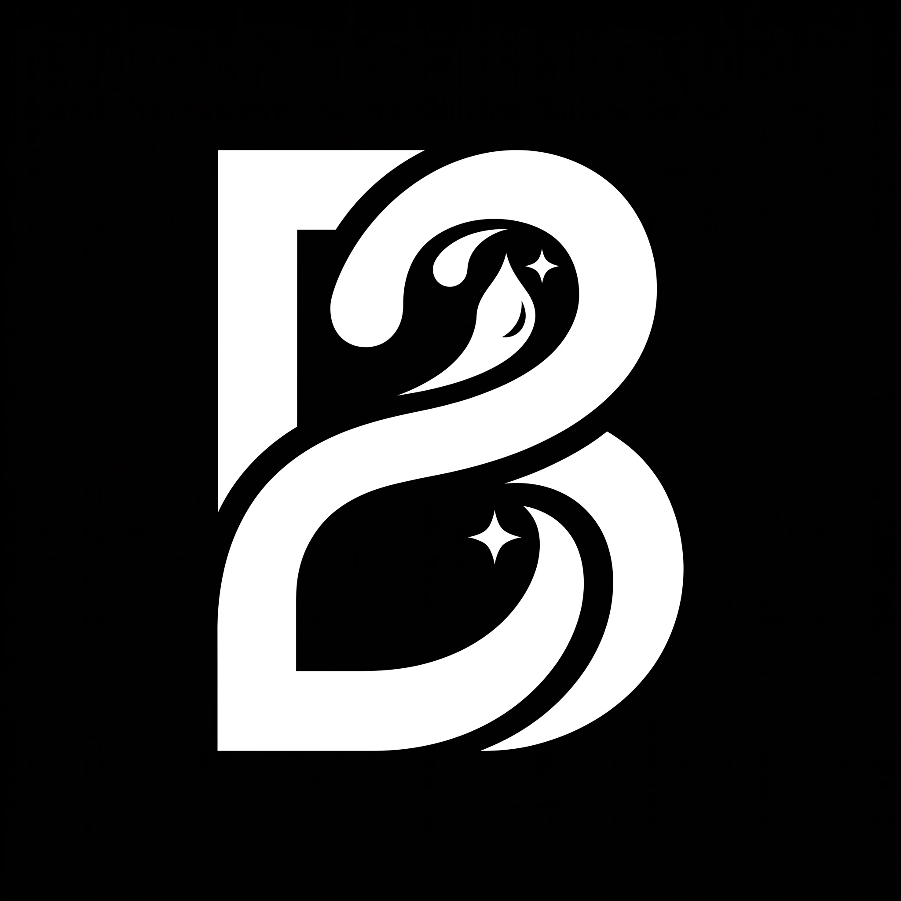
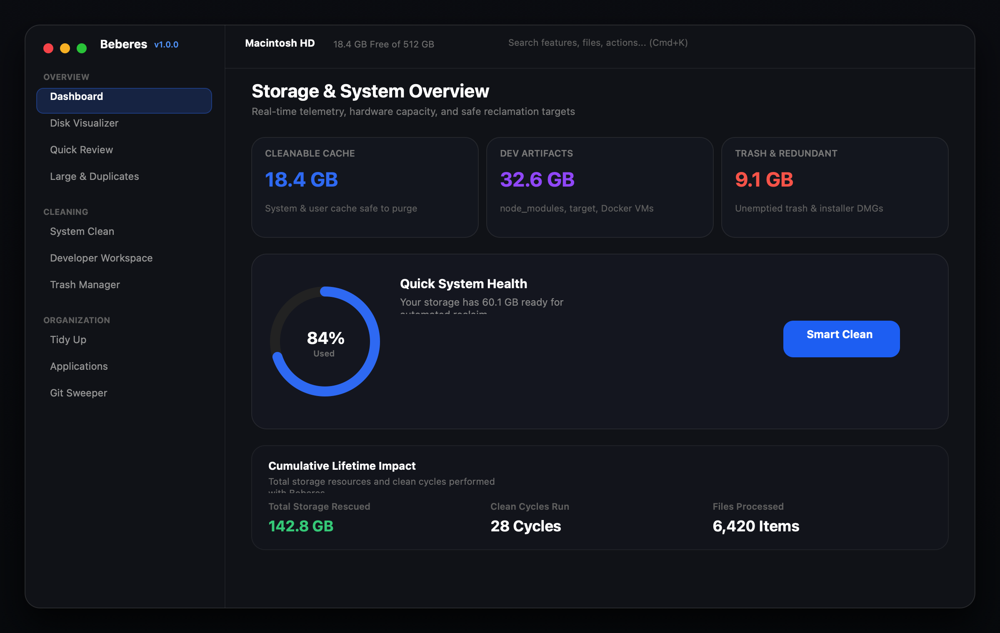
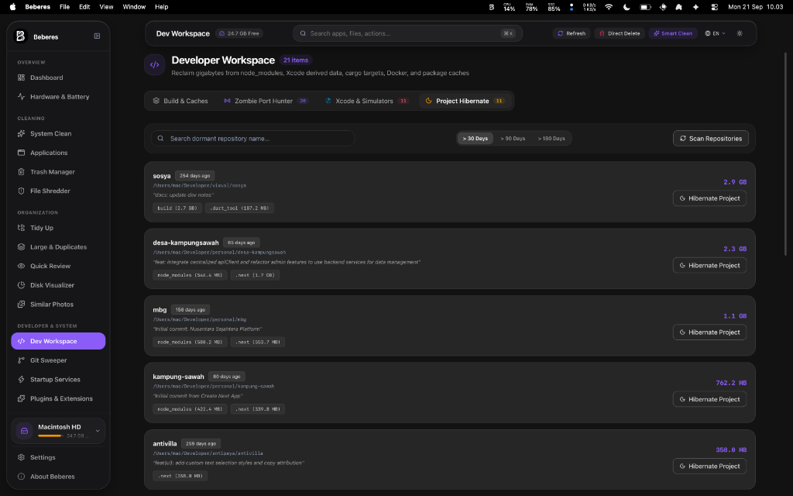
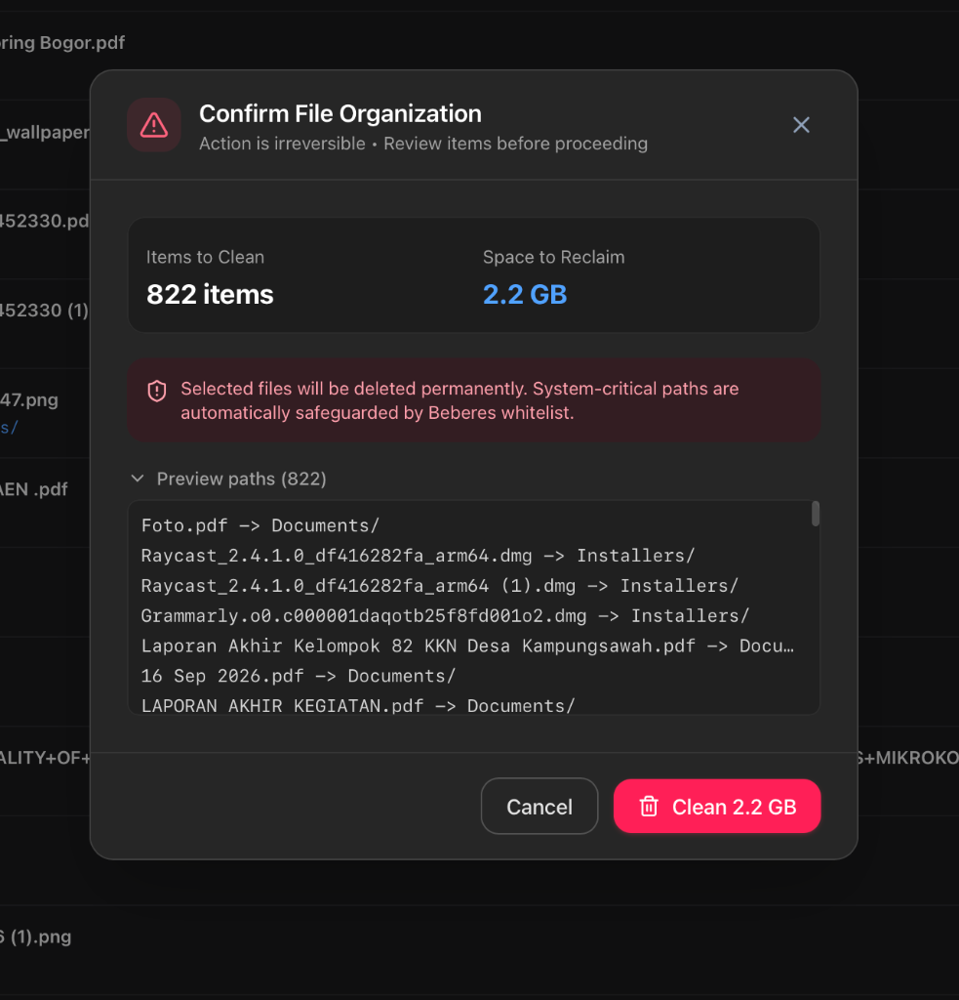
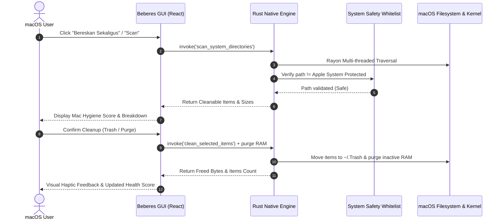

<p align="center">
  
</p>

<h1 align="center">Beberes</h1>

<p align="center">
  <strong>High-Performance, Local-First System Cleaner & Storage Optimizer for macOS and Developers.</strong>
</p>

<p align="center">
  <a href="https://github.com/naenmad/Beberes/releases"></a>
  <a href="LICENSE"></a>
  <a href="https://tauri.app/"></a>
  <a href="https://www.rust-lang.org/"></a>
  <a href="https://www.apple.com/macos/"></a>
  
  <a href="https://github.com/sponsors/naenmad"></a>
</p>

<p align="center">
  
</p>

<p align="center">
  <a href="#why-beberes">Why Beberes?</a> &bull;
  <a href="#key-features">Key Features</a> &bull;
  <a href="#screenshots">Screenshots</a> &bull;
  <a href="#installation">Installation</a> &bull;
  <a href="#building-from-source">Building from Source</a> &bull;
  <a href="#architecture">Architecture</a> &bull;
  <a href="#security--privacy">Security</a> &bull;
  <a href="#support--sponsoring">Sponsoring</a> &bull;
  <a href="#license">License</a>
</p>

---

## Why Beberes?

Traditional macOS cleanup utilities often come bundled with proprietary background daemons, aggressive subscription paywalls, and persistent network telemetry.

**Beberes** (*Sundanese/Indonesian for "tidying up"*) is built from the ground up to be different:
- **Blazingly Fast**: Powered by a native Rust core, multi-threaded Rayon directory traversal, and direct POSIX filesystem operations.
- **100% Local-First & Private**: Zero tracking, zero analytics, zero network beacons, and zero cloud calls.
- **Developer-Tailored**: Built-in deep cleaners for `node_modules`, Python virtual environments, Xcode DerivedData, Docker/OrbStack VMs, and dangling Git packfiles.
- **Safety First**: Protected whitelist prevents accidental damage to core macOS system directories, with native macOS Trash put-back integration.
- **Apple Design Language**: Frosted glassmorphism interface with fluid animations, keyboard-driven navigation, and Spotlight Search (`Cmd+K`).
- **macOS Native Polish**: Native Menu Bar status tray, Hold Cmd+Q to quit with radial progress HUD, Close-to-Hide window management, and thermal/battery awareness.

---

## Key Features

Beberes comes equipped with specialized modules designed for complete Mac maintenance, workspace hygiene, and storage reclamation:

| Module | Description | Target Areas |
| :--- | :--- | :--- |
| **Storage Dashboard** | Real-time hardware overview, storage utilization, 0-100% **Mac Hygiene Score**, and 1-click **Bereskan Sekaligus** master clean. | System root, RAM memory, and attached volumes |
| **Orphaned App Leftovers** | Scans and purges abandoned directories left behind in Library by apps that have already been uninstalled. | `~/Library/Application Support`, `~/Library/Caches`, `Containers` |
| **Smart Automation Rules** | 1-click non-destructive automated filing: auto-archives downloads > 30 days and consolidates desktop screenshots. | `~/Downloads`, `~/Desktop`, `~/Pictures/Screenshots` |
| **Homebrew & Tooling Pruner** | Purges outdated bottles, temporary downloads, and expired lockfiles via `brew cleanup --prune=all` with live terminal log. | `/opt/homebrew`, `/usr/local/Homebrew`, package caches |
| **Developer Workspace** | Deep workspace and package manager cleaner across 14 tech stacks: Node.js, Rust, Flutter/Dart, Go, Python, Java Maven, Docker, PHP Composer, AI/Ollama Models, Ruby, .NET NuGet, C/C++ CMake. | `node_modules`, `target/`, `.pub-cache`, `go-build`, `~/.m2`, `~/.ollama` |
| **APFS Snapshot Purger** | Detects and safely clears local Time Machine snapshots taking up hidden gigabytes in macOS "System Data" / purgeable space. | APFS local snapshot metadata (`tmutil`) |
| **RAM Inactive Memory Optimizer** | Flushes dormant disk cache memory back to free physical RAM via the native macOS kernel memory manager. | Inactive and purgeable memory pages (`vm_stat`, `purge`) |
| **Deep Browser Cleaner** | Purges code caches, GPU caches, Service Worker temp files, and HTTP caches across 6 major browsers while preserving cookies and logins. | Safari, Chrome, Arc, Brave, Firefox, Edge |
| **macOS Menu Bar Status Tray** | Native status bar menu with 1-click Quick Clean, Free RAM, Empty Trash, and direct view jumping. | macOS Menu Bar tray icon |
| **Disk Space Visualizer** | Interactive hierarchical treemap visualizer with drill-down exploration, breadcrumbs, and proportional storage heatmaps. | Any local or external directory |
| **Quick Review** | Rapid triage tool for Downloads and Desktop with arrow-key keyboard navigation, file previews, and inline renaming. | `~/Downloads`, `~/Desktop`, `~/Pictures` |
| **Large & Duplicate Files** | Fast SHA-256 duplicate content detector and size-ranked large file finder. | User libraries, media collections, archives |
| **Tidy Up** | Intelligent file organizer categorizing loose files into tidy folders and sweeping redundant `.dmg` / `.pkg` installers. | Desktop, Downloads, custom folders |
| **App Uninstaller** | Comprehensive uninstaller with leftover inspection, bundle ID detection, and Apple system protection. | `/Applications`, `~/Applications` |
| **Trash Manager** | Visual macOS Trash inspector with individual item deletion, path inspection, and secure emptying. | `~/.Trash` and external drive trash bins |
| **Startup Daemons** | Inspect, enable, disable, and clean macOS `LaunchAgents` and `LaunchDaemons`. | `~/Library/LaunchAgents`, `/Library/LaunchAgents` |
| **File Shredder** | Multi-pass cryptographic sanitization (1-Pass Zero, 3-Pass DoD 5220.22-M, 7-Pass Gutmann Lite). | Sensitive documents, keys, credentials |
| **Git Sweeper** | Aggressive repository compression (`git gc --prune=now`) and merged local branch pruning. | Local developer workspaces (e.g. `~/Developer`) |

### Additional Capabilities
- **Multi-Drive & Flashdisk Detection**: Automatically enumerates external drives and USB flashdisks mounted under `/Volumes/*` with instant live switching.
- **Global Spotlight Search (`Cmd+K`)**: Navigate anywhere in the application or trigger actions via instant keyboard search.
- **Full Keyboard Navigation & A11y**: Direct tab switching (`Cmd+1` through `Cmd+9`), global refresh (`Cmd+R`), settings (`Cmd+,`), and Escape modal dismissal.
- **Finder Drag & Drop**: Drag files, folders, or `.app` bundles directly into Beberes to inspect, tidy, or uninstall immediately.
- **Thermal & Battery Throttling Awareness**: Dynamically adjusts background scan threads when your MacBook runs on low battery to prevent overheating.
- **Audio Haptic Feedback**: Native Web Audio API sounds for trash emptying and completion chimes (with settings mute toggle).
- **Appearance & Scaling**: Full support for native macOS Light and Dark mode, plus adjustable UI scaling (Compact, Normal, Large).

---

## Screenshots

<div align="center">
  
  <p><em>Developer Workspace Deep Cleaner — Reclaiming gigabytes from Cargo target, Docker VMs, and node_modules</em></p>
</div>

<div align="center">
  
  <p><em>Smart Whitelist Safeguards — Interactive confirmation modal protecting system directories</em></p>
</div>

---

## Installation

### Method 1: Pre-Built Binary (.dmg)

Download the latest release for your Mac architecture from the [GitHub Releases](https://github.com/naenmad/Beberes/releases) page:

- **Apple Silicon (M1/M2/M3/M4)**: Download `Beberes_1.1.0_aarch64.dmg`
- **Intel Macs (x86_64)**: Download `Beberes_1.1.0_x64.dmg`

Open the `.dmg` file and drag **Beberes** into your **Applications** folder.

### Method 2: Homebrew Cask

Install directly in a single command:

```bash
brew tap naenmad/beberes https://github.com/naenmad/Beberes
brew install --cask beberes
```

---

## Troubleshooting: "Beberes is damaged and can't be opened"

When launching Beberes for the first time on macOS, Gatekeeper may display a security dialog:

> **"Beberes is damaged and can't be opened. You should move it to the Trash."**  
> *or*  
> **"Apple cannot check it for malicious software."**

### Why does this happen?
Beberes is a 100% free and open-source project. Because it is not yet signed with a paid Apple Developer certificate ($99/year), macOS Gatekeeper automatically places newly downloaded binaries into quarantine. **The application is completely safe and not damaged.**

### Solution 1: Terminal Command (Fastest & Recommended)
Open **Terminal** (`Cmd + Space`, type `Terminal`) and paste the following command:

```bash
xattr -cr /Applications/Beberes.app
```

If prompted for administrative privileges, run with `sudo`:
```bash
sudo xattr -rd com.apple.quarantine /Applications/Beberes.app
```

Once executed, open **Beberes** normally from Launchpad or Applications.

### Solution 2: macOS System Settings (GUI)
1. In **Finder**, open your **/Applications** folder.
2. **Right-click** (or Control-click) on **Beberes.app** and select **Open**.
3. In the warning prompt that appears, click the **Open** button.
4. *Alternatively*: Open **System Settings > Privacy & Security**, scroll down to the **Security** section, and click **Open Anyway**.

---

## Building from Source

### Prerequisites
- macOS 12.0 (Monterey) or later
- [Xcode Command Line Tools](https://developer.apple.com/xcode/): `xcode-select --install`
- [Rust](https://rustup.rs/) (version 1.75 or higher): `curl --proto '=https' --tlsv1.2 -sSf https://sh.rustup.rs | sh`
- [Node.js](https://nodejs.org/) (v18+) or [Bun](https://bun.sh/)

### Steps

1. **Clone the repository**:
   ```bash
   git clone https://github.com/naenmad/Beberes.git
   cd Beberes
   ```

2. **Install frontend dependencies**:
   ```bash
   bun install # or npm install
   ```

3. **Run in development mode**:
   ```bash
   bun run tauri dev
   ```

4. **Build the production application & DMG installer**:
   ```bash
   bun run build:dmg
   ```
   The compiled DMG installer will be located in `src-tauri/target/release/bundle/dmg/`.

---

## Architecture & System Design

Beberes is built with a decoupled client-core architecture:

```mermaid
graph TD
    subgraph UI["Frontend Layer (React 19 + TypeScript + Tailwind CSS)"]
        A[Dashboard & Mac Hygiene Score] --> B[Zustand Central State Store]
        C[System Clean & Browsers] --> B
        D[App Uninstaller & Orphaned Leftovers] --> B
        E[Developer Workspace & Homebrew Pruner] --> B
        F[Tidy Up & Smart Automation Rules] --> B
        G[APFS Snapshot & Inactive RAM Purger] --> B
        H[Disk Visualizer & Quick Review] --> B
    end

    subgraph IPC["Tauri v2 IPC Bridge"]
        B <==>|Asynchronous Message Passing| I[Tauri Invoke Handlers]
    end

    subgraph Rust["Backend Core (Rust Native System Engine)"]
        I --> J[Parallel Filesystem Scanner / Rayon]
        I --> K[Apple System Whitelist Validator]
        I --> L[macOS Memory & APFS Kernel Interface]
        I --> M[Homebrew & Package CLI Orchestrator]
        I --> N[POSIX statvfs Disk & Volume Metrics]
        I --> O[Native macOS Trash & File Shredder]
    end

    subgraph OS["macOS System Layer"]
        J --> P[APFS Filesystem / User Library]
        L --> Q[vm_stat / purge & tmutil Snapshots]
        M --> R[/opt/homebrew & Global Package Stores]
        O --> S[~/.Trash & Multi-drive Volumes]
    end
```

### Safety & Cleaning Pipeline

Every deletion in Beberes undergoes strict safety validation before execution:



> [!TIP]
> For extended architecture flowcharts, state machine diagrams, module-to-IPC mapping tables, and safety guardrail matrices, see [docs/MERMAID.md](docs/MERMAID.md) and [docs/ARCHITECTURE.md](docs/ARCHITECTURE.md).

---

## Security & Privacy

Beberes is engineered with strict local-first security guardrails:
- Zero network telemetry, cloud calls, or third-party trackers.
- Protected macOS system directory whitelisting (`/System`, `/usr`, `/bin`, etc.).
- Operates within standard user privileges without background root daemons.

For security vulnerabilities or responsible disclosure practices, please review our [Security Policy](SECURITY.md).

---

## Internationalization

Beberes is fully localized across 5 languages:

- English (`en`)
- Indonesian (`id`)
- Japanese (`ja`)
- Simplified Chinese (`zh`)
- Spanish (`es`)

Language selection is instantly switchable from the top navigation bar without requiring an application restart.

---

## Support & Sponsoring

Beberes is free, open-source software built for the developer and macOS community. If Beberes helps you keep your Mac clean and fast, please consider supporting its continuous development:

<p align="center">
  <a href="https://github.com/sponsors/naenmad"></a>
  &nbsp;&nbsp;
  <a href="https://trakteer.id/madnaen"></a>
  &nbsp;&nbsp;
  <a href="https://ko-fi.com/madnaen"></a>
</p>

### Where does the support go?

All donations and sponsorships are allocated transparently toward:

1. **Device Upgrade Savings**: Building savings to acquire newer test hardware and Apple Silicon/Intel machines for compatibility verification.
2. **Street Feeding Stray Cats**: A regular portion of contributions goes directly into buying pet food for stray and community cats in the neighborhood.
3. **Repository Operations & Expansion**: Covering infrastructure expenses such as domain names, dedicated website/server hosting, Apple Developer Program licensing for code signing/notarization, and ongoing feature research.

---

## Contributing

We welcome contributions of all kinds from the community!
- Suggest features or report bugs via [GitHub Issues](https://github.com/naenmad/Beberes/issues).
- Review our [Contributing Guidelines](CONTRIBUTING.md) for local setup, code style, and PR process.
- Read our [Code of Conduct](CODE_OF_CONDUCT.md).

---

## License

This project is licensed under the [GNU General Public License v3.0](LICENSE).
Copyright (c) 2026 naenmad.
