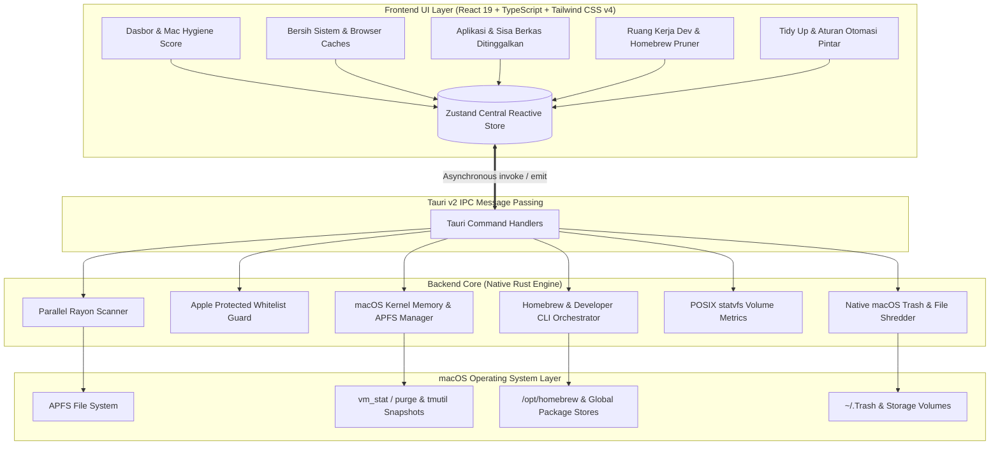
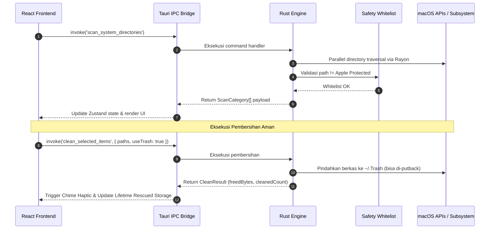

# System Architecture & Tech Stack

## 1. High-Level Overview

Aplikasi **Beberes** menggunakan arsitektur **Decoupled Hybrid Desktop** yang memisahkan antarmuka pengguna (Frontend berbasis Webview modern) dan logika pemrosesan sistem berkinerja tinggi (Backend native Rust), dijembatani oleh mekanisme IPC asinkron bawaan Tauri v2.

---

## 2. Core Tech Stack (High Performance & Zero Overhead)

| Komponen | Teknologi | Peran & Keunggulan |
| :--- | :--- | :--- |
| **Desktop Shell** | Tauri v2 | Footprint memori sangat kecil (~30-40 MB RAM), zero Chromium overhead, native macOS webview. |
| **Backend Engine** | Rust 2021 | Kecepatan setara C/C++, memori aman tanpa Garbage Collector, multi-threading Rayon paralel. |
| **Frontend UI** | React 19 + TypeScript | UI deklaratif reaktif, type-safe, performa render optimal dengan view caching. |
| **Styling & Theme** | Tailwind CSS v4 | macOS frosted glassmorphism, responsive, dark/light mode, reduced-motion & high-contrast. |
| **State Store** | Zustand v5 | Centralized reactive store tanpa re-render churn yang tidak perlu. |
| **Iconography** | Lucide React + Authentic Brand SVGs | Vektor tajam resolusi tinggi untuk Retina display macOS. |

---

## 3. Komunikasi Antar Layer & Alur Kerja

---

## 4. Rust Crate Dependencies Utama

- **`tokio`**: Runtime asynchronous untuk I/O non-blocking dan event loop.
- **`rayon`**: Work-stealing data-parallelism untuk memindai direktori raksasa secara multithreaded.
- **`serde` & `serde_json`**: Serialisasi payload IPC berkinerja tinggi antara Rust dan TypeScript.
- **`sysinfo`**: Mengambil metrik CPU, pemakaian RAM fisik, dan statistik volume disk secara real-time.
- **`dirs`**: Deteksi jalur direktori standar platform macOS (`~/Library`, `~/Downloads`, dll.).
- **`trash`**: Integrasi resmi ke recycle bin / Trash macOS dengan kemampuan restore.

---

## 5. Diagram Lengkap & Alur Kerja

Untuk melihat seluruh diagram Mermaid (State Machine, Whitelist Guardrail, Orphaned App Detection Logic, Smart Rules Pipeline, dan Tabel Referensi Komprehensif), buka [docs/MERMAID.md](MERMAID.md).
