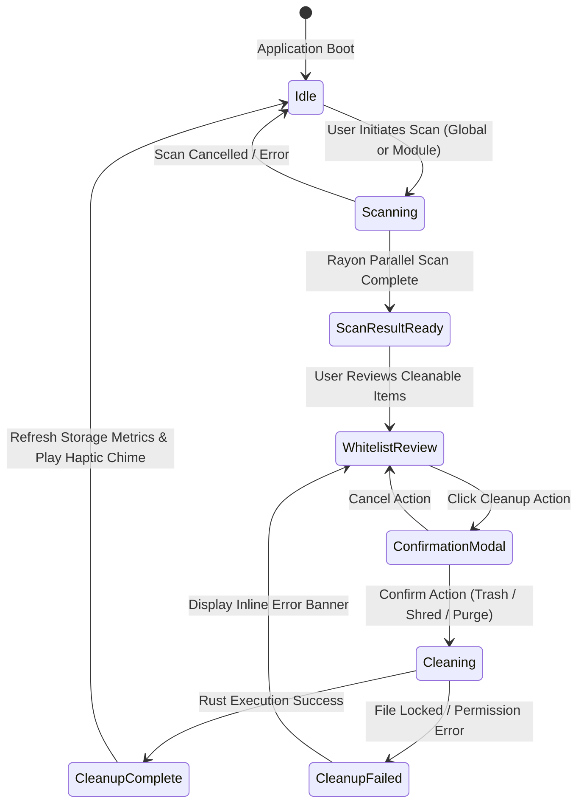
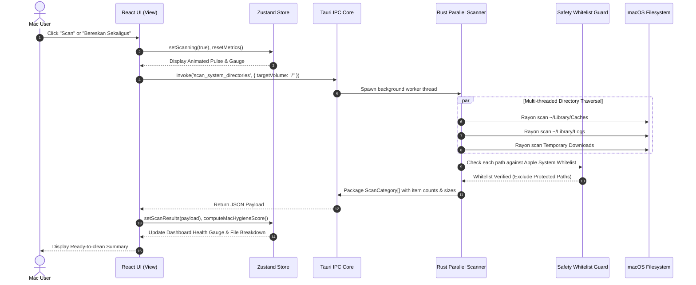
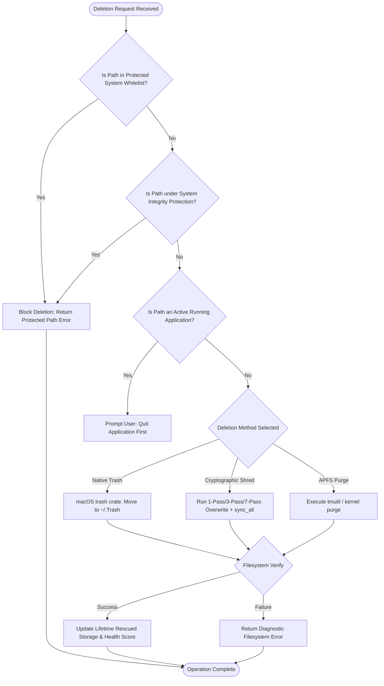
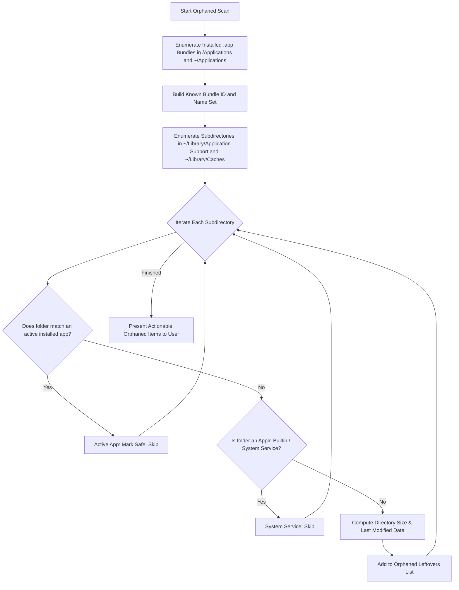
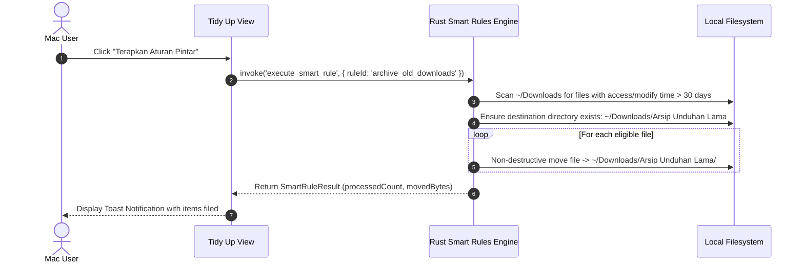

# Beberes Architectural Diagrams & System Workflows

This document details the internal architecture, IPC channels, state lifecycles, and safety verification workflows of **Beberes** using Mermaid diagrams and structured reference tables.

---

## 1. High-Level System Architecture

Beberes implements a decoupled Hybrid Desktop model. The graphical interface runs within a lightweight native Webview (WKWebView on macOS), communicating exclusively via typed asynchronous IPC message-passing with a multi-threaded Rust native core.

```mermaid
graph TD
    subgraph Frontend["Frontend Layer (React 19 + TypeScript + Tailwind CSS v4)"]
        UI_Dash[Dashboard & Hygiene Score]
        UI_Clean[System Clean & Browser Caches]
        UI_Uninstaller[App Uninstaller & Orphaned Leftovers]
        UI_Dev[Developer Workspace & Tooling Pruner]
        UI_Tidy[Tidy Up & Smart Automation Rules]
        UI_Review[Quick Review & Triage Engine]
        UI_Vis[Disk Space Treemap Visualizer]
        UI_Shred[Cryptographic File Shredder]
        UI_Trash[Native Trash Inspector]
        UI_Startup[LaunchAgent Startup Manager]
        UI_Git[Git Repository Sweeper]

        Store[(Zustand Central State Store)]

        UI_Dash --> Store
        UI_Clean --> Store
        UI_Uninstaller --> Store
        UI_Dev --> Store
        UI_Tidy --> Store
        UI_Review --> Store
        UI_Vis --> Store
        UI_Shred --> Store
        UI_Trash --> Store
        UI_Startup --> Store
        UI_Git --> Store
    end

    subgraph Bridge["Tauri v2 IPC Bridge"]
        Store <==>|Asynchronous invoke / emit| IPC[Tauri Command Router]
    end

    subgraph Backend["Native Rust Engine (Multi-threaded Core)"]
        IPC --> Mod_Scanner[commands::scanner]
        IPC --> Mod_Cleaner[commands::cleaner]
        IPC --> Mod_Orphaned[commands::orphaned]
        IPC --> Mod_SmartRules[commands::smart_rules]
        IPC --> Mod_Memory[commands::memory]
        IPC --> Mod_Snapshots[commands::snapshots]
        IPC --> Mod_Browser[commands::browser]
        IPC --> Mod_Organizer[commands::organizer]
        IPC --> Mod_Reviewer[commands::reviewer]
        IPC --> Mod_Uninstaller[commands::uninstaller]
        IPC --> Mod_Shredder[commands::shredder]
        IPC --> Mod_Trash[commands::trash]
        IPC --> Mod_Startup[commands::startup]
        IPC --> Mod_Git[commands::git_sweeper]
        IPC --> Mod_Visualizer[commands::visualizer]
        IPC --> Mod_Maintenance[commands::maintenance]
        IPC --> Mod_Finder[commands::finder]
    end

    subgraph OS["macOS Operating System Layer"]
        Mod_Scanner --> OS_FS[APFS File System / POSIX statvfs]
        Mod_Cleaner --> OS_Trash[Native ~/.Trash Subsystem]
        Mod_Orphaned --> OS_Lib[~/Library/Application Support & Caches]
        Mod_SmartRules --> OS_UserDirs[~/Downloads, ~/Desktop, ~/Pictures]
        Mod_Memory --> OS_Kernel[macOS Kernel Memory Manager: vm_stat / purge]
        Mod_Snapshots --> OS_TM[Apple APFS Snapshots: tmutil]
        Mod_Shredder --> OS_IO[CSPRNG Overwrite & Direct sync_all I/O]
        Mod_Git --> OS_CLI[Git Subprocess Engine]
        Mod_Maintenance --> OS_Brew[Homebrew: /opt/homebrew & /usr/local]
        Mod_Startup --> OS_Launchd[LaunchAgents & LaunchDaemons]
    end
```

---

## 2. Architecture & Module Reference Table

| Module Name | Frontend View | Rust Module (`src-tauri/src/commands/`) | Key Tauri IPC Commands | Target System Components | Safety Classification |
| :--- | :--- | :--- | :--- | :--- | :--- |
| **Storage Dashboard** | `Dashboard.tsx` | `scanner.rs`, `memory.rs` | `get_system_info`, `scan_system_directories`, `purge_inactive_memory` | `libc::statvfs`, `sysinfo`, `vm_stat` | Read-only / Low Risk |
| **System Clean** | `SystemClean.tsx` | `scanner.rs`, `cleaner.rs`, `browser.rs` | `scan_system_directories`, `clean_selected_items`, `scan_browser_caches`, `clean_browser_caches` | User Caches, System Logs, Browser Temp Folders | Trash Protected (Put-back supported) |
| **App Uninstaller** | `AppUninstaller.tsx` | `uninstaller.rs`, `orphaned.rs` | `scan_installed_applications`, `uninstall_application_items`, `scan_orphaned_leftovers`, `clean_orphaned_leftovers` | `/Applications`, `~/Library/Application Support`, `Containers` | High Safety (System Apps Whitelisted) |
| **Developer Workspace** | `DevWorkspace.tsx` | `scanner.rs`, `maintenance.rs` | `scan_developer_artifacts`, `clean_developer_artifacts`, `run_homebrew_cleanup` | `node_modules`, `target/`, `.pub-cache`, `/opt/homebrew` | Developer Controlled |
| **Tidy Up & Smart Rules**| `TidyUp.tsx` | `organizer.rs`, `smart_rules.rs` | `scan_folder_tidy`, `execute_tidy_organization`, `scan_smart_rules`, `execute_smart_rule` | `~/Downloads`, `~/Desktop`, installer archives | Non-destructive Filing |
| **Quick Review** | `QuickReview.tsx` | `reviewer.rs`, `organizer.rs` | `scan_review_items`, `review_rename_file`, `review_trash_file` | Downloads, Desktop triage | Trash Protected |
| **Disk Visualizer** | `DiskVisualizer.tsx` | `visualizer.rs` | `scan_directory_tree` | Arbitrary accessible volumes | Read-only |
| **File Shredder** | `FileShredder.tsx` | `shredder.rs` | `shred_file_items` | Targeted user files | Permanent (CSPRNG Overwrite) |
| **Trash Manager** | `TrashManager.tsx` | `trash.rs` | `scan_trash_contents`, `empty_trash_bin`, `delete_trash_item` | `~/.Trash`, External Volume Trashes | Permanent on confirm |
| **Startup Daemons** | `StartupManager.tsx`| `startup.rs` | `scan_startup_items`, `toggle_startup_item`, `remove_startup_item` | `~/Library/LaunchAgents`, `/Library/LaunchAgents` | System Protected |
| **Git Sweeper** | `GitSweeper.tsx` | `git_sweeper.rs` | `scan_git_repositories`, `sweep_git_repository` | Local git repositories | Safe Git Operations (`git gc`) |

---

## 3. Application State Lifecycle

The application operates as an event-driven state machine managed by Zustand in the frontend, synchronizing with asynchronous background tasks in the Rust engine.

---

## 4. End-to-End System Scanning Workflow

This sequence diagram illustrates the parallel scanning mechanism that computes cleanable storage without freezing the graphical user interface:

---

## 5. Safety Whitelist & Safe Deletion Pipeline

To guarantee that system-critical files, kernel extensions, and active applications are never damaged, every delete operation must pass multiple validation gates:

---

## 6. System Safety Guardrail Matrix

| Protected Directory | Protected Scope | Enforcement Mechanism |
| :--- | :--- | :--- |
| `/System` | macOS Core Kernel, Frameworks, and Bundled Utilities | Hardcoded rust blacklist + System Integrity Protection (SIP) |
| `/usr`, `/bin`, `/sbin` | POSIX System Binaries and System Libraries | Hardcoded rust blacklist |
| `/Library/Apple` | Apple System Extensions and Security Assets | Safety whitelist check |
| `/Applications/Utilities` | Native Apple Diagnostics (Terminal, Console, Disk Utility) | Uninstaller exclusion filter |
| `/Applications/Safari.app` | Default System Browser | Uninstaller exclusion filter |
| `~/Library/Keychains` | User Credentials and Cryptographic Certificates | Path exclusion filter |
| `~/Library/Mail` | User Mail Databases and Local Messages | Path exclusion filter |
| `~/.ssh`, `~/.gnupg` | SSH Private Keys and GPG Keyrings | Hardcoded blacklist in shredder & organizer |

---

## 7. Orphaned App Leftovers Discovery Logic

When an application is dragged directly to Trash, configuration files, caches, and application support folders remain orphaned. Beberes reconciles these against installed bundles:

---

## 8. Smart Automation Rules Execution Pipeline

Smart Automation Rules provide 1-click filing for accumulated loose files without removing valuable user documents:

---

## 9. Technology Stack Specifications

| Layer | Technology | Version / Standard | Primary Responsibilities |
| :--- | :--- | :--- | :--- |
| **Runtime Container** | Tauri Desktop Runtime | 2.x | Secure native webview wrapper, window lifecycle, native menus, IPC message router |
| **System Language** | Rust | 2021 Edition (1.75+) | High-throughput file I/O, POSIX metric collection, process orchestration, cryptographic shredding |
| **Concurrency Model** | Rayon | 1.10+ | Work-stealing parallel iterator for multi-threaded directory exploration |
| **Async Runtime** | Tokio | 1.x | Non-blocking execution for external CLI tooling (`brew`, `git`, `tmutil`) |
| **Frontend Framework**| React | 19.x | Declarative component tree, optimistic updates, responsive layouts |
| **Type Validation** | TypeScript | 5.x | Strict compile-time safety across all IPC payloads and component props |
| **Styling System** | Tailwind CSS | 4.x | macOS glassmorphism, variable tokens, dark/light theme switching, responsive grid |
| **State Management** | Zustand | 5.x | Centralized reactive store for scanning status, theme settings, and metrics |
| **Vector Assets** | Lucide React | 1.x | Minimalist SVG icons rendered at macOS Retina pixel densities |
