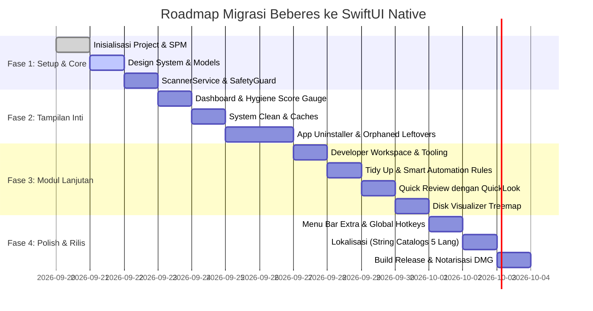

# Beberes Migration Blueprint: Tauri v2 to Pure SwiftUI

Dokumen ini adalah cetak biru teknis dan panduan langkah demi langkah untuk memigrasikan **Beberes** dari arsitektur saat ini (React 19 + TypeScript + Tauri v2 + Rust) menuju **Pure Native macOS Application (SwiftUI + Swift Concurrency + AppKit)**.

---

## 1. Visi & Alasan Migrasi

| Indikator | Tauri v2 (Saat Ini) | Pure SwiftUI Native |
| :--- | :--- | :--- |
| **Footprint Memori (RAM)** | ~35 - 55 MB (WebKit runtime overhead) | ~12 - 22 MB (Zero web runtime) |
| **Ukuran Paket Aplikasi** | ~12 - 18 MB | ~5 - 8 MB |
| **Performa Animasi & UI** | 60 - 120 fps via WKWebView | 120 fps ProMotion murni (Metal / Core Animation) |
| **Integrasi macOS** | Melalui layer serialisasi IPC JSON | Langsung memanggil Cocoa, Foundation, dan Kernel Darwin |
| **QuickLook & Preview** | Terbatas (iframe / web thumbnail) | `QLPreviewView` native Apple (semua format file instan) |
| **Menu Bar Tray** | Plugin Tauri Tray | `MenuBarExtra` native SwiftUI |
| **Notarisasi & App Store** | Memerlukan bundle packaging khusus | Standar bawaan Xcode & `xcodebuild` |

---

## 2. Arsitektur Sasaran (Target Architecture)

Aplikasi akan menggunakan arsitektur **MVVM (Model-View-ViewModel)** modern berbasis Swift Concurrency (`async`/`await`, `TaskGroup`, `actor`) dan macro `@Observable` (macOS 14+).

```mermaid
graph TD
    subgraph UI["SwiftUI Native Presentation Layer"]
        AppEntry[BeberesApp.swift / @main]
        MenuBar[MenuBarExtra / Status Tray]
        NavView[NavigationSplitView / Sidebar]

        View_Dash[DashboardView]
        View_Clean[SystemCleanView]
        View_Uninstaller[AppUninstallerView]
        View_Dev[DevWorkspaceView]
        View_Tidy[TidyUpView]
        View_Review[QuickReviewView]
        View_Vis[DiskVisualizerView]
        View_Shred[FileShredderView]
        View_Trash[TrashManagerView]

        AppEntry --> NavView
        AppEntry --> MenuBar
        NavView --> View_Dash
        NavView --> View_Clean
        NavView --> View_Uninstaller
        NavView --> View_Dev
        NavView --> View_Tidy
        NavView --> View_Review
        NavView --> View_Vis
        NavView --> View_Shred
        NavView --> View_Trash
    end

    subgraph State["State & ViewModels (@Observable)"]
        AppState[AppState.swift / Central Observable]
        ScanVM[ScanViewModel]
        UninstallerVM[UninstallerViewModel]
        DevVM[DevWorkspaceViewModel]
        TidyVM[TidyUpViewModel]

        View_Dash --> ScanVM
        View_Clean --> ScanVM
        View_Uninstaller --> UninstallerVM
        View_Dev --> DevVM
        View_Tidy --> TidyVM
        ScanVM --> AppState
        UninstallerVM --> AppState
        DevVM --> AppState
        TidyVM --> AppState
    end

    subgraph Core["Core Services & Swift Actors"]
        Service_Scan[actor ScannerService]
        Service_Safety[struct SafetyGuard]
        Service_Trash[struct TrashService]
        Service_Orphaned[actor OrphanedAppService]
        Service_Memory[struct MemoryService]
        Service_SmartRules[actor SmartRulesService]
        Service_Dev[actor DeveloperCleanerService]
        Service_Shred[actor ShredderService]
    end

    subgraph OS["macOS Native Subsystems"]
        Service_Scan --> FS[FileManager / URLResourceValues]
        Service_Trash --> TrashAPI[FileManager.trashItem]
        Service_Memory --> MachKernel[mach/host_statistics64 & /usr/bin/purge]
        Service_Safety --> SIP[System Integrity Protection & App Bundles]
        Service_Dev --> BrewCLI[/opt/homebrew & Package Stores]
        Service_Shred --> CSPRNG[SecRandomCopyBytes & fcntl F_FULLFSYNC]
    end

    State --> Core
```

---

## 3. Pemetaan Komponen: React/Rust -> SwiftUI/Swift

| Fitur Saat Ini | React Component (`src/views/`) | Rust Module (`src-tauri/`) | SwiftUI View Target | Swift Native Service / Engine |
| :--- | :--- | :--- | :--- | :--- |
| **Window Shell** | `App.tsx`, `MainLayout.tsx` | `lib.rs`, `main.rs` | `BeberesApp.swift`, `MainView.swift` | `NavigationSplitView`, `MenuBarExtra` |
| **Storage Dashboard** | `Dashboard.tsx`, `HealthGauge.tsx` | `scanner.rs`, `memory.rs` | `DashboardView.swift`, `HygieneGaugeView.swift` | `ScannerService`, `MemoryService` |
| **System Clean** | `SystemClean.tsx` | `cleaner.rs`, `browser.rs` | `SystemCleanView.swift` | `ScannerService`, `TrashService` |
| **App Uninstaller** | `AppUninstaller.tsx` | `uninstaller.rs`, `orphaned.rs` | `AppUninstallerView.swift` | `AppInspectorService`, `OrphanedAppService` |
| **Dev Workspace** | `DevWorkspace.tsx` | `scanner.rs`, `maintenance.rs` | `DevWorkspaceView.swift` | `DeveloperCleanerService`, `HomebrewService` |
| **Tidy Up & Rules** | `TidyUp.tsx` | `organizer.rs`, `smart_rules.rs` | `TidyUpView.swift`, `SmartRulesSheet.swift` | `SmartRulesService`, `OrganizerService` |
| **Quick Review** | `QuickReview.tsx` | `reviewer.rs` | `QuickReviewView.swift` | Native `QLPreviewView` (QuickLook) |
| **Disk Visualizer** | `DiskVisualizer.tsx` | `visualizer.rs` | `DiskVisualizerView.swift` | `VisualizerService` + Custom SwiftUI Canvas |
| **File Shredder** | `FileShredder.tsx` | `shredder.rs` | `FileShredderView.swift` | `ShredderService` (`SecRandomCopyBytes`) |
| **Trash Manager** | `TrashManager.tsx` | `trash.rs` | `TrashManagerView.swift` | `TrashService` (AppleScript / Cocoa API) |
| **Startup Daemons** | `StartupManager.tsx` | `startup.rs` | `StartupManagerView.swift` | `LaunchAgentService` (`SMAppService`) |
| **Git Sweeper** | `GitSweeper.tsx` | `git_sweeper.rs` | `GitSweeperView.swift` | `GitService` (`Process` wrapper) |
| **Spotlight Search** | `CommandPalette.tsx` | Frontend filter | `SpotlightCommandPalette.swift` | SwiftUI `.sheet` + Keyboard Event Mon |

---

## 4. Rincian Teknis Migrasi Core Logic (Rust -> Swift)

### A. Penggantian Parallel Scanner (Rayon -> Swift Concurrency TaskGroup)
Di Rust:
```rust
categories.par_iter().map(|cat| scan_category(cat)).collect()
```
Di Swift:
```swift
actor ScannerService {
    func scanAllCategories() async -> [ScanCategory] {
        await withTaskGroup(of: ScanCategory.self) { group in
            for category in CategoryRegistry.allCases {
                group.addTask {
                    await self.scanCategory(category)
                }
            }
            var results: [ScanCategory] = []
            for await result in group {
                results.append(result)
            }
            return results
        }
    }
}
```

### B. Penggantian Native Trash (trash Crate -> FileManager)
Di Swift, pemindahan ke Trash mendukung fitur native "Put Back" tanpa perlu pustaka eksternal:
```swift
struct TrashService {
    static func moveToTrash(url: URL) throws {
        var resultingURL: NSURL?
        try FileManager.default.trashItem(at: url, resultingItemURL: &resultingURL)
    }
}
```

### C. Pembebasan RAM Inactive (vm_stat & purge)
Di Swift:
```swift
struct MemoryService {
    static func purgeInactiveMemory() async throws {
        let task = Process()
        task.executableURL = URL(fileURLWithPath: "/usr/bin/purge")
        try task.run()
        task.waitUntilExit()
    }
}
```

### D. Cryptographic Shredder
Di Swift menggunakan Security framework dan POSIX `fcntl`:
```swift
actor ShredderService {
    func shredFile(at url: URL, passes: Int) throws {
        let handle = try FileHandle(forUpdating: url)
        let length = try handle.seekToEnd()
        let fd = handle.fileDescriptor
        
        for _ in 0..<passes {
            try handle.seek(toOffset: 0)
            var buffer = [UInt8](repeating: 0, count: 65536)
            var remaining = length
            while remaining > 0 {
                let chunkSize = min(Int(remaining), buffer.count)
                SecRandomCopyBytes(kSecRandomDefault, chunkSize, &buffer)
                try handle.write(contentsOf: Data(buffer[0..<chunkSize]))
                remaining -= UInt64(chunkSize)
            }
            fcntl(fd, F_FULLFSYNC)
        }
        try handle.close()
        try FileManager.default.removeItem(at: url)
    }
}
```

---

## 5. Rencana Pelaksanaan Bertahap (Phased Roadmap)



### Tahapan Eksekusi:

- [ ] **Fase 1: Inisialisasi Fondasi**
  - Buat folder atau proyek Swift Package / Xcode di branch `feature/swiftui-native`.
  - Implementasikan `AppState.swift`, `AppTheme.swift` (warna aksen, glassmorphism), dan tipe data model.
  - Implementasikan `SafetyGuard.swift` (daftar folder terlindungi).

- [ ] **Fase 2: Porting Layanan Utama & Tampilan Pertama**
  - Implementasikan `ScannerService.swift` dengan pemindaian paralel.
  - Bangun `DashboardView.swift` dengan Health Gauge interaktif.
  - Bangun `SystemCleanView.swift` dengan integrasi Trash `trashItem`.

- [ ] **Fase 3: Porting Modul Aplikasi & Pengembang**
  - Implementasikan `AppInspectorService` dan `OrphanedAppService`.
  - Bangun `AppUninstallerView.swift` dengan tab sisa berkas.
  - Bangun `DevWorkspaceView.swift` untuk membersihkan `node_modules`, Cargo `target`, dan Homebrew.

- [ ] **Fase 4: Porting Utilitas & Visualizer**
  - Bangun `TidyUpView.swift` dan aturan otomasi pintar.
  - Bangun `QuickReviewView.swift` yang memanfaatkan `QLPreviewView` native.
  - Bangun `DiskVisualizerView.swift` menggunakan layout Treemap di Canvas.
  - Bangun `FileShredderView.swift`, `TrashManagerView.swift`, `StartupManagerView.swift`.

- [ ] **Fase 5: Integrasi Native macOS & Lokalisasi**
  - Konfigurasi `MenuBarExtra` untuk menu status bar.
  - Implementasikan `String Catalog` untuk multi-bahasa (`en`, `id`, `ja`, `zh`, `es`).
  - Tambahkan efek suara native via `NSSound`.

- [ ] **Fase 6: Pengemasan & Pengujian**
  - Uji perizinan Full Disk Access (FDA) di macOS Sequoia/Sonoma.
  - Otomasi pembuatan DMG rilis.

---

## 6. Strategi Git & Percabangan

Untuk menjaga aplikasi yang sudah dirilis (v1.1.0 Bayu) tetap stabil:
1. Cabang `main` tetap berisi kode produksi Tauri v2.
2. Buat cabang baru khusus pengembangan:
   ```bash
   git checkout -b feature/swiftui-native
   ```
3. Setelah seluruh modul mencapai *feature parity* dan lolos verifikasi menyeluruh, cabang ini siap diintegrasikan sebagai **Beberes v2.0.0 (Pure Native Swift)**.
